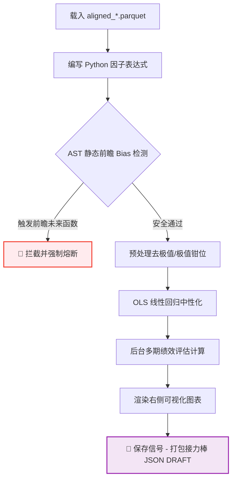

# 🔬 Alpha 因子实验室 - 因子挖掘与绩效评估使用指南

在量化交易研究中，因子挖掘是设计超额收益（Alpha）策略的核心。**Alpha 因子实验室 (Alpha Lab - Ultimate)** 提供了一个集“因子设计、数据清洗、风险中性化、多期绩效评估及静态前瞻防呆安全审计”于一体的专业级研发平台。

---

## 目录
1. [因子研发工作流 (Baton Relay)](#1-因子研发工作流-baton-relay)
2. [输入面板参数详解](#2-输入面板参数详解)
    - [2.1 数据源配置 (Data Source)](#21-数据源配置-data-source)
    - [2.2 因子表达式与 AST 静态安全审计机制 (Factor Expression & AST)](#22-因子表达式与-ast-静态安全审计机制-factor-expression--ast)
    - [2.3 数据预处理 (Preprocessing)](#23-数据预处理-preprocessing)
    - [2.4 风险中性化 (Neutralization)](#24-风险中性化-neutralization)
    - [2.5 因子评价配置 (Evaluation Config)](#25-因子评价配置-evaluation-config)
3. [输出面板与可视化图表深度解读](#3-输出面板与可视化图表深度解读)
    - [3.1 📊 Metrics KPI (指标总览表)](#31--metrics-kpi-指标总览表)
    - [3.2 IC Analysis (IC 时序分析图)](#32-ic-analysis-ic-时序分析图)
    - [3.3 IC Decay (IC 衰退时空图)](#33-ic-decay-ic-衰退时空图)
    - [3.4 Quantile Analysis (分位数损益与表现图)](#34-quantile-analysis-分位数损益与表现图)
    - [3.5 Risk Analysis (风险因子相关性热力图)](#35-risk-analysis-风险因子相关性热力图)
    - [3.6 Stability & Reality (稳定性与换手率审计)](#36-stability--reality-稳定性与换手率审计)
4. [因子的导出与接力保存 (Save & Relay)](#4-因子的导出与接力保存-save--relay)

---

## 1. 因子研发工作流 (Baton Relay)

因子挖掘的业务流程定位如下，它完美承接了数据对齐产出的数据集，并为后续的回测引擎提供信号保障：

---

## 2. 输入面板参数详解

操作时请对照主窗口左侧配置区：

### 2.1 数据源配置 (Data Source)
* **File (文件选择)**：下拉框自动扫描并列出 `data/processed/` 目录下的对齐数据集，以及 `Master DB` 的历史单资产行情。
* **数据审计状态标签 (🔒 Mode Info)**：
  * 系统在选定文件后自动执行数据审计，展示数据量、起止日期，并智能识别两类分析模式：
    * **`🔒 Mode: Single Asset`**：单资产因子挖掘。
    * **`🔗 Mode: Aligned / Multi-Asset`**：多资产对齐数据集。
  * **Target Return (目标收益列)**：下拉框智能罗列行情中所有的价格候选字段（如 `myx-fcpo1!_close`）。系统将依据该价格计算因子的未来远期收益率（Forward Returns），用作因子的预测标的。
  * **Only evaluate overlap rows (仅评估重叠行)**：仅在多资产对齐数据包含 `is_overlap` 字段时激活。勾选后，因子计算仅在所有资产都在开市交易的“黄金重叠时间”进行，屏蔽单边休市的噪音。

---

### 2.2 因子表达式与 AST 静态安全审计机制 (Factor Expression & AST)
* **语法规范**：因子的生成基于 Python 计算语法，因子值必须赋值给 `df['factor']`，例如：
  `df['factor'] = df['close'] / df['open']`
* **底层库依赖**：可在表达式中直接调用 Pandas、Numpy 的大部分常规计算函数。

> [!CAUTION]
> #### 🔒 因子挖掘底线：AST 静态代码前瞻偏差拦截机制
> **“前瞻偏差” (Look-ahead Bias)** 是量化研究中最致命的幽灵——即在 $t$ 时刻的因子计算中误用了 $t+N$ 时刻的未来行情。一旦因子中混入“未来毒素”，回测表现会极其完美，但实盘将遭遇毁灭性崩盘。
> 
> **系统防秒杀机制**：在您点击“运行分析”的瞬间，平台会对您的 Python 代码进行 **AST (Abstract Syntax Tree, 抽象语法树)** 解析。一旦检测到以下敏感字段或语法结构，**将立即强行熔断计算，弹出红色警报**：
> 1. **前瞻位移**：`shift(-N)`（负数位移代表访问未来数据）。
> 2. **前瞻切片**：`iloc[-1]` 或类似在未做 `shift(1)` 隔离的滚动窗口中访问最新行边界。
> 
> *静态安全拦截完全发生在 UI 线程计算之前，确保任何前瞻毒素在源头上被 100% 隔离熔断！*

---

### 2.3 数据预处理 (Preprocessing)
* **Method (Winsorize 方法)**：极值处理方法，提供以下 3 种去极值手段，清洗掉高频交易或异常波动产生的价格噪声：
  * **`3-Sigma`**：均值加减 3 倍标准差以外的极值强制盖帽钳位。
  * **`MAD` (Median Absolute Deviation)**：中位数绝对偏差去极值。相比 3-Sigma 更加鲁棒，不易受极值本身对均值的拉动影响。
  * **`Quantile` (分位数去极值)**：直接切除用户设定的分位数边界。
* **Quantile LB & UB (分位数上下限)**：例如设置 `0.01` 与 `0.99`，代表将最极端的 1% 的极大值和极小值向外钳平。
* **Auto-drop Zero Volume Rows (自动剔除零成交量行)**：勾选后，系统会自动剔除 Volume 字段为 0 的样本点，防止停盘日非交易数据对因子均值的稀释和扭曲。

---

### 2.4 风险中性化 (Neutralization)
* **Select Risk Factors (选择风险因子)**：
  * 行情列出的可选多维度数字特征复选框（如 High, Low, Volume 字段）。
  * **业务原理**：因子常常与资产的价格水平、波动率或成交量高度相关（例如“动量因子”天然带有很高的“波动率偏向”）。中性化利用 **OLS (普通最小二乘法线性回归)** 算法，将您的因子作为因变量，选中的风险因子作为自变量进行回归，**提取残差值作为纯净的“风险中性化因子”**。
* **OLS 线性回归**：该回归模型提取与其自变量严格正交的残差值作为纯净的“风险中性化因子”，在数学上保障了风格暴露的绝对安全性。

---

### 2.5 因子评价配置 (Evaluation Config)
* **Periods (预测周期)**：默认 `1, 3, 5, 10, 20`（逗号隔开的整数）。
* **业务含义**：指示因子将预测未来第几个 K 线（或交易日）的 forward returns。例如设置 10，代表该因子将用来预测未来 10 个 Bar 后的资产收益。系统会为每个设定的周期单独计算一套绩效指标。

---

## 3. 输出面板与可视化图表深度解读

分析完成后，右侧面板会展示 7 个分析标签页，用以全方位审计因子的绩效表现：

### 3.1 📊 Metrics KPI (指标总览表)
通过上方的 `Period` 下拉菜单，可切换查看不同预测周期下的因子得分细节：

| 评估指标 | 业务物理定义 | 判别阈值与及格线 | Rating 状态评级标准 |
| :--- | :--- | :--- | :--- |
| **Rank IC Mean** | Spearman 秩相关系数均值。衡量因子值与未来真实收益率排名的相关性。 | $> 0.05$ (强信号方向) $< -0.05$ (强反向信号) | **Strong** (绝对值 $>0.05$) **Weak** (绝对值 $\le 0.05$) |
| **ICIR** | 因子信息比率：Rank IC 序列均值 / Rank IC 标准差。衡量因子稳定度。 | $> 0.5$ (良好稳定性) $> 1.0$ (极佳，神级因子) | **Excellent** (ICIR $>1.0$) **Good** ($>0.5$) **Neutral** ($\le 0.5$) |
| **T-Stat** | 对 Rank IC 序列执行 **Newey-West 异方差自相关稳健性调整** 的 T 检验值。 | 绝对值 $\ge 2.0$ | **Pass** (显著，绝对值 $\ge 2.0$) **Watch** (临界，$\ge 1.65$) **Weak** (不显著，$<1.65$) |
| **Plain T-Stat** | 普通 T 检验值（未作 Newey-West 序列自相关修正，作对比参考）。 | - | 作为 NW T-stat 的对比参考基准 |
| **P-Value** | 基于 T-Stat 计算得到的显著性概率（第一类错误概率）。 | $< 0.05$ (即有 95% 把握因子非随机) | **Pass** ($P < 0.05$) **Neutral** ($P \ge 0.05$) |
| **Win Rate** | 因子方向调整后的 **单期预测胜率**。 | $> 55\%$ | **Good** ($>55\%$) **Neutral** ($45\% \sim 55\%$) **Unstable** ($<45\%$) |
| **Sample N** | 参与评估的有效时间切片或滚动样本数。 | $> 60$ (大样本稳健) | **Good** ($\ge 60$) **Watch** ($30 \sim 60$) **Weak** ($< 30$ 样本过小) |

---

### 3.2 IC Analysis (IC 时序分析图)
* **图表表现**：柱状图。横轴为时间轴（交易周期），纵轴为单期 Rank IC 表现。
* **颜色标识**：**绿色**代表当期 IC 为正，**红色**代表当期 IC 为负。
* **业务解读**：
  * 理想的高稳定度因子其柱状图应呈现**一边倒的颜色**（例如动量因子大多为绿柱，反转因子大多为红柱），且波动较小。
  * 若红绿柱频繁交替且高度杂乱，表示该因子在时序上面临极大的均值漂移，实盘表现极易失效。

---

### 3.3 IC Decay (IC 衰退时空图)
* **图表表现**：折线图。横轴为设定的预测期数（Period 1 ➔ 20），纵轴为 Rank IC 的数值大小。
* **业务解读**：
  * **完美因子衰退线**：从左下（短周期强相关）向右下平缓衰退。这代表短周期预测性极强，且其有效性能够在中周期（Period 5-10）得到延续。
  * **骤死型因子衰退线**：在 Period 1 很高，但到 Period 3 陡然跌为 0。此类因子属于高频高衰退因子，仅适合极高频剥头皮策略，不适合中长周期持有（因为摩擦成本会迅速吃光收益）。

---

### 3.4 Quantile Analysis (分位数损益与表现图)
系统将全样本因子按照值的大小均分为 **5 个组（Q1 最低, Q5 最高）**，进行分组回测：
* **Mean Return by Quantile (分位数平均收益柱状图)**：
  * **理想单调因子**：柱子高度应呈现严格单调递增（Q1➔Q2➔Q3➔Q4➔Q5）或单调递减。这证明因子对收益具有非常强的“区分度”。
  * **混乱因子**：柱子高矮参差不齐（例如 Q3 收益最高，Q1 和 Q5 都低）。此类非线性因子无法通过简单的线性方向进行策略多空构建。
* **Cumulative Returns by Quantile (分位数累计收益曲线图)**：
  * 追踪 5 个分位数多头组合随时间增长的净值表现。
  * **策略构建判定**：Q5 曲线（绿色）应在最上方，Q1 曲线（红色）应在最下方。两者的**开口间距越大**，代表该因子的超额收益捕获力（多空两极区分度）越卓越。

---

### 3.5 Risk Analysis (风险因子相关性热力图)
* **图表表现**：Coolwarm（红蓝）色调的对称矩阵热力图。
* **业务解读**：
  * 展示中性化后因子与各个原始行情因子（价格、成交量）之间的相关系数。
  * 蓝色代表负相关，红色代表正相关，颜色越深相关度越高。
  * **风控预警**：若中性化因子与某一风险因子（如 `close`）的相关系数绝对值依然高达 `0.7` 以上，说明 OLS 中性化因子与自变量回归不彻底，或因子本身完全退化为价格的线性组合，需要警惕风险暴露。

---

### 3.6 Stability & Reality (稳定性与换手率审计)
因子在线性回测中表现好并不代表其实盘能够赚钱，必须考虑**摩擦成本**：
* **Quantile Turnover (换手率时序折线图)**：
  * 衡量因子在相邻两个 Bar 之间，分位数持仓列表发生变更的比例（即从 Q5 跌落或新晋的比例）。
  * **判别标准**：
    * **`Low Cost / 低换手` (< 20%)**：因子极其稳定，调仓成本低，极利于实盘。
    * **`High Cost / 高换手` (> 50%)**：持仓天天发生剧烈变动，佣金和滑点将彻底摧毁这一策略的实际盈利。
* **Lag-1 Autocorrelation (因子自相关度条形图)**：
  * 评估因子自身的时序平稳度。数值越接近 `1.0`（高自相关），代表因子值随时间过渡越平滑，交易信号的发生越扎实稳定，避免频繁的伪买卖震荡。

---

## 4. 因子的导出与接力保存 (Save & Relay)

分析满足要求后，必须将因子安全打包输出，才能供后续的回测与风控模块使用：

1. **`Export to Backtest` (蓝按钮)**：
   * 自动清洗因子序列（安全剔除由于计算暖机导致的头部 NaNs 和 Close 缺失值）。
   * 将清洗后的干净数据以标准 Parquet 格式导出。
2. **`💾 保存信号` (紫按钮 - 核心接力棒机制)**：
   * **启动一键打包机制**：在弹出框中输入您的策略 ID（如 `STG01`）和名称（如 `Mean_Reversion_FCPO`）。
   * **自动构造 Baton Relay Package (接力包)**：系统会自动生成如下双核心文件，并聚拢归档于 `datacenter/Alpha_data/<文件夹>/` 目录下：
     * **`*_data.parquet` (信号文件)**：保存清洗后的核心因子值，并在底层 Parquet 元数据中写入因子评价指标。
     * **`*_config.json` (策略 DNA 雏形)**：将当前因子的计算上下文（Universe、Timeframe、Python 表达式、Winsorize 设定、风险中性化列表及专业绩效指标）打包为**标准策略 DNA 配置规范**。
   * **价值**：**该 JSON Config 相当于因子的“遗传基因档案”**。有了这份配置，后续的 **回测引擎** 能够一键载入所有参数，确保量化流水线完美闭环！
