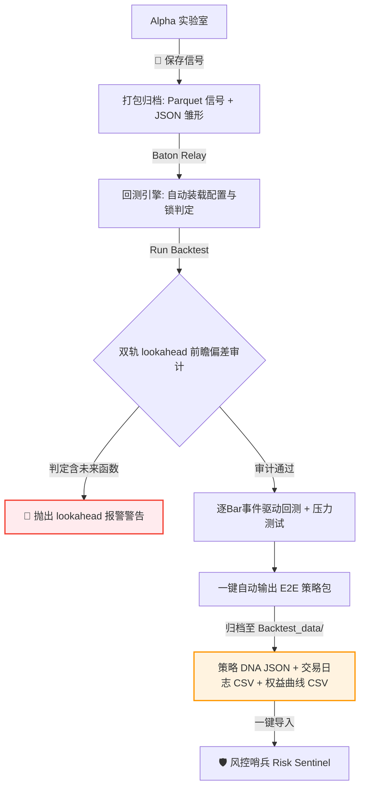

# 🚀 回测引擎与策略压力测试使用指南

回测是桥接“因子挖掘”与“实盘风控”之间的核心桥梁。**回测引擎 (Backtest Engine)** 采用工业级的 **逐Bar事件驱动状态机 (Event-Driven State Machine)**，全面模拟保证金交易、单边佣金、滑点、动态 ATR 仓位管理、午休/隔夜强制平仓以及条内移动止损，并配备前瞻偏差双轨审计和滑点敏感性压力测试。

---

## 目录
1. [回测接力机制 (Baton Relay Workflow)](#1-回测接力机制-baton-relay-workflow)
2. [输入面板参数详解](#2-输入面板参数详解)
    - [2.1 信号源载入与防抖检查 (Signal Source)](#21-信号源载入与防抖检查-signal-source)
    - [2.2 市场与交易成本参数 (Market Params)](#22-市场与交易成本参数-market-params)
    - [2.3 策略与执行参数 (Strategy Params)](#23-策略与执行参数-strategy-params)
    - [2.4 交易执行与时间窗口控制](#24-交易执行与时间窗口控制)
3. [输出面板与绩效指标深度解读](#3-输出面板与绩效指标深度解读)
    - [3.1 📊 核心回测绩效指标 (Table Grid)](#31--核心回测绩效指标-table-grid)
    - [3.2 敏感性压力测试 (Pressure Test Table)](#32-敏感性压力测试-pressure-test-table)
    - [3.3 可视化图表深度解读](#33-可视化图表深度解读)
4. [双轨前瞻审计与保证金监控 (Audit & Margin Call)](#4-双轨前瞻审计与保证金监控-audit--margin-call)

---

## 1. 回测接力机制 (Baton Relay Workflow)

回测引擎不仅是一个计算器，更是量化研发流水线中的**核心资产归档接力点**。其运转流程如下：

---

## 2. 输入面板参数详解

操作时请对照主窗口左侧回测配置面板：

### 2.1 信号源载入与防抖检查 (Signal Source)
* **File (选择信号源)**：下拉框自动加载 `datacenter/Alpha_data/` 目录下的所有已保存信号 Parquet 文件。
* **状态锁警告 (Status Lock)**：
  * **机制**：如果系统检测到该策略已被风控部门或质检流程标记为 **`PRODUCTION_READY`**（生产部署就绪状态），UI 将弹出强警告：`“该策略当前状态为 PRODUCTION_READY，通常禁止修改。您确定要强行重新回测并覆盖现有的质检结果吗？”`。
  * **作用**：防御性保护机制，防止开发人员误操作覆盖已上线策略的“黄金 DNA 记录”。

---

### 2.2 市场与交易成本参数 (Market Params)
* **Multiplier (合约乘数)**：
  * **业务定义**：单手合约的价格点数所对应的林吉特（RM）现金价值。
  * **典型设置**：马交所棕榈油期货 `FCPO` 默认为 `25.00`（即价格波动 1 点代表 25 令吉收益）。
* **Comm (RM/Lot) (单边手续费)**：每手交易扣除的佣金成本（单边扣除，一次完整的买卖将扣除双倍佣金）。
* **Slippage (Pts) (双边滑点点数)**：
  * **业务定义**：由于市价单冲击成本或网络延迟导致执行价劣于信号发出价的点数偏差。
  * **底层离散化钳位**：系统根据产品 Tick Size 进行**硬性对称离散化结算**。
    * **买入入场/平空出场**：执行价向上取整（Ceil）加上滑点：`exec_price = math.ceil((fill_price + slippage) / tick_size) * tick_size`。
    * **卖出入场/平多出场**：执行价向下取整（Floor）减去滑点：`exec_price = math.floor((fill_price - slippage) / tick_size) * tick_size`。
* **Init Margin (RM) (每手初始保证金)**：
  * **业务定义**：单手开仓所需的林吉特保证金要求，是计算杠杆比例和“保证金追缴（Margin Call）”的基准。

---

### 2.3 策略与执行参数 (Strategy Params)
* **Strategy Type (策略类型)**：
  * **`Mean Reversion` (均值回归)**：因子值跌破下轨做多，涨破上轨做空（适合震荡市）。
  * **`Momentum Breakout` (动量突破)**：因子值突破上轨做多，跌破下轨做空（适合趋势市）。
  * **`Direct Signal` (直接信号直通模式)**：允许脚本直接输出交易信号（`1` 代表做多，`-1` 代表做空，`0` 代表平仓），适合高度非线性且不对称的多因子共振逻辑。
* **Capital (RM) (初始资金)**：策略回测账户的本金（默认 `100,000.00`），用作计算累计收益和回撤百分比的基线。
* **Upper Bound (>) & Lower Bound (<) (入场上下轨)**：
  * **传统模式下**：用作因子值的线性切片判断阈值。
  * **在 `Direct Signal` 模式下**：这两个输入框作为**信号判定的动态过滤器阈值**。
    * **多头入场 (1)**：当 `factor > Upper Bound` 时触发（若设为 `0.50`，由于脚本输出的做多信号 `1.0 > 0.50`，会被精准捕获）。
    * **空头入场 (-1)**：当 `factor < Lower Bound` 时触发（若设为 `-0.50`，由于脚本输出的做空信号 `-1.0 < -0.50`，会被精准捕获）。
    * **平仓 (0)**：其他中间区间（例如 `0.0`）将被识别为平仓/无仓位状态。
    * *注：保留这两个输入框有利于应对系统对因子进行的 Z-Score 标准化缩放，保持极强的容错与防抖性。*
* **Risk Target (%) (波动率风控目标)**：
  * **业务定义**：基于 **ATR (平均波幅)** 的动态头寸比例管理。
  * **机制**：若设为 `0.0`，系统执行固定 `1手`（1 Lot）的极简模式；若设为大子，系统将自动检索上一 Bar 结算的 ATR，**利用资产的波动率自适应计算当期下单手数**，将风险敞口控制在账户总权益的指定比例之内。
* **Max Lots (最大手数)**：风控强约束，该策略在任何时间点允许持有的最大合约总手数（默认 `20`）。
* **ADX Filter (>20) (趋势强度过滤器)**：
  * **机制**：勾选后，若上一 Bar 的 ADX 趋势强度指标值低于 20，系统将自动**过滤并拦截所有的入场信号**，防止策略在无趋势的锯齿状猴市中被频繁“两头打脸”。
* **Intra-bar SL (%) (条内移动止损)**：
  * **业务定义**：条（Bar）内止损设置。若设为 `1.00%`，当持仓期内行情最高（或最低）价格相比入场均价的不利变动达到 1.00% 时，**在 Bar 内瞬间触发止损清仓**，有效防御日内闪崩风险（`0` 代表关闭）。
* **Exec Mode (执行模式 - 极关键)**：
  * **`Close (T)` (收盘执行)**：基于 $t$ 时刻的因子值，在 $t$ 时刻的收盘价执行。主要用于粗颗粒日线研究。
  * **`Next Open (T+1)` (次日开盘执行 - 强力推荐)**：基于 $t$ 时刻的因子值，在 $t+1$ 时刻的开盘价执行。**这是安全防前瞻的真实交易环境模拟**，彻底消除回测中因“信号产生➔市价下单”微秒级时间偏差引起的未来数据泄露。

---

### 2.4 交易执行与时间窗口控制
* **Hold Overnight? (持仓过夜)**：若不勾选，引擎在每日收盘前最后一根K线（通常为 18:00）**强行平仓**，实现日内策略，彻底规避隔夜跳空缺口风险。
* **Hold Lunch? (持仓过午休)**：若不勾选，在马交所上午休盘前最后一根K线（12:30）**强行平仓**，下午开盘重新评估，规避休盘期间外盘波动的风险。

---

## 3. 输出面板与绩效指标深度解读

回测结束后，右侧面板将激活数据与图表的可视化展示：

### 3.1 📊 核心回测绩效指标 (Table Grid)

右侧上方的表格以双列并排形式列出系统计算的各项机构级绩效指标：

| 评估指标 | 业务物理定义与计算公式 | 优秀策略判别及格线 |
| :--- | :--- | :---: |
| **Total Net Profit** | **总净利润**：平仓已实现收益 - 交易双边摩檫成本。 | 视本金规模而定 |
| **Profit Factor** | **获利因子**：总毛利润 / 总毛损失。衡量赚一令吉需要承担多少令吉的亏损风险。 | $> 1.5$ (及格) $> 2.0$ (极佳) |
| **Win Rate (%)** | **平仓胜率**：盈利平仓次数 / 总平仓次数。 | $> 45\%$ (配合高盈亏比) |
| **Max Drawdown (%)** | **最大回撤率**：整个回测区间内，权益曲线（包含未平仓浮动损益 Mark-to-Market）从历史最高顶点跌落到最低谷底的最大幅度。 | $< 15\%$ (极佳) $> 30\%$ (风控危险) |
| **Max DD Duration** | **最大回撤持续时间**：账户资产卡在回撤状态中无法创出历史新高的最长 Bar 周期数。 | 越短越好 |
| **Sharpe Ratio** | **夏普比率**：年化超额收益率 / 年化日净值收益率波动率。衡量承担每单位总风险所获取的超额回报。 | $> 1.5$ (及格) $> 2.5$ (非常优秀) |
| **Calmar Ratio** | **卡马比率**：年化净利润率 / 最大回撤率。衡量收益与回撤性价比的核心指标。 | $> 2.0$ (及格) $> 4.0$ (风控极度偏好) |
| **Margin Status** | **保证金追缴状态**：账户的杠杆安全状态。若有 breach，则高亮显示 **`MARGIN CALL` (保证金追缴/强平拦截)** 警告。 | **Safe** |

---

### 3.2 敏感性压力测试 (Pressure Test Table)

在左侧点击 **`🔥 Pressure Test` (橙色按钮)** 后，系统会以极速并行方式，对策略执行 **滑点敏感性压力测试 (Slippage Sensitivity Test)**。

右侧上方的压力测试结果表展示在不同滑点摩擦下策略的生存状态：
* **测试区间**：分别测算滑点为 `0`、`1`、`2`、`3` 个 Ticks 下的 **总净利润 (Net Profit)**、**最大回撤 (MDD %)** 以及 **总平仓次数 (Trades)**。
* **业务诊断价值**：
  * **高抗噪策略**：随着滑点增加，净利润缓慢衰退，滑点为 3 时依然能稳定盈利。
  * **脆弱策略 (Paper Tiger)**：在滑点为 0-1 时赚钱，但滑点一旦达到 2-3，净利润立刻腰斩甚至转为巨亏。**此类策略极度脆弱，绝不可实盘上线**（因为真实市场的成交价差会迅速将利润吞噬干净）。

---

### 3.3 可视化图表深度解读

右侧下方标签页提供了 4 个 Matplotlib 渲染的动态分析图：

1. **Equity Curve (权益曲线图)**：
   * **折线图**：展示包含未平仓浮动盈亏的 **实时盯市权益 (MtM Equity)** 变化轨迹。
   * **参考线**：灰色虚线代表 `Initial Capital` (初始资金起点)；红色虚线代表 `Margin Call Level` (最低维持保证金线 - $80\%$ 警戒线)。
   * **业务判别**：绿色的 MtM 权益曲线应稳定呈 45 度角向上爬升。若曲线剧烈起伏甚至频繁逼近红色的警戒线，代表仓位开得过大，杠杆极度危险。
2. **Net Pnl Distribution (净损益分布直方图)**：
   * **图表表现**：直方图。中间灰色虚线为 0 轴（Breakeven，盈亏平衡线）。
   * **颜色标识**：0 轴右侧的盈利平仓单以**绿色**显示，左侧的亏损平仓单以**红色**显示。
   * **业务解读**：理想的图表应呈现“肥尾效应”——红色的亏损区域矮小且集中（代表止损坚决，亏损受控），而绿色的盈利区域出现向右延伸的长尾（代表截断亏损，让利润奔跑）。
3. **Drawdown (回撤深度填充图)**：
   * **面积图**：红色的悬挂式充填图，直观展示每一次权益从顶峰回撤的深度和持续时间。
   * **标注**：在最深回撤点自动高亮标注 `Max DD: XX.XX%` 的具体日期和大小。
4. **Risk Indicators (ATR & ADX 风险指标图)**：
   * **双坐标线图**：青色实线展示 $ATR(14)$ 波动率走势，品红色虚线在右轴展示 $ADX(14)$ 趋势强度指标，并配有 `20` 轴基准线。用于审查策略进场时市场是否处于高波、强势状态。

---

## 4. 双轨前瞻审计与保证金监控 (Audit & Margin Call)

回测引擎在底层部署了主动式防御卫兵，防止研发欺骗：

> [!IMPORTANT]
> ### 🚨 前瞻偏差双轨校验警告 (Look-Ahead Bias Audit)
> 在回测运行时，引擎在后台自动复制一份完全平行的 **“防漏防前瞻双轨校验器”**：
> * **校验机制**：同时运行 $t$ 时刻 Close 模式与 $t-1$ 时刻 Next Open 模式。如果检测到两者平仓损益偏差超过预定阈值（如偏离度 $>10\%$），UI 顶端状态栏会立刻高亮变色报警：**`⚠️ POTENTIAL LOOK-AHEAD BIAS DETECTED`**，并弹出提示框展示：
>   * *Original Profit (未审计利润)*
>   * *Audited Profit (T-1 延迟审计利润)*
>   * *Deviation (前瞻偏差偏离百分比)*
> * **处置**：请立即检查您的因子中是否混入了未来函数或非法切片，此时的回测利润纯属虚幻。

> [!CAUTION]
> ### 🛡️ 保证金追缴与强平干预 (Margin Call Enforcement)
> 平台拥有完整的虚拟交易所规则：
> 1. **逐Bar盯市**：实时检测账户权益（Equity）是否跌破“维持保证金限额”（Maintenance Margin = 已占用保证金 $\times 80\%$）。
> 2. **日内强平**：一旦跌破，或者单日最大资产回撤达到 $20\%$ 等风控红线，Risk Interceptor 风控截获器会在 Bar 内**强制执行平仓操作**。
> 3. **记录出险**：交易日志中的平仓原因将标记为 `Margin_Call_Gap_Open`（开盘跳空爆仓）或 `Margin_Call_Intraday`（日内穿仓强平），帮助您在研发阶段精准识别策略爆仓点。
